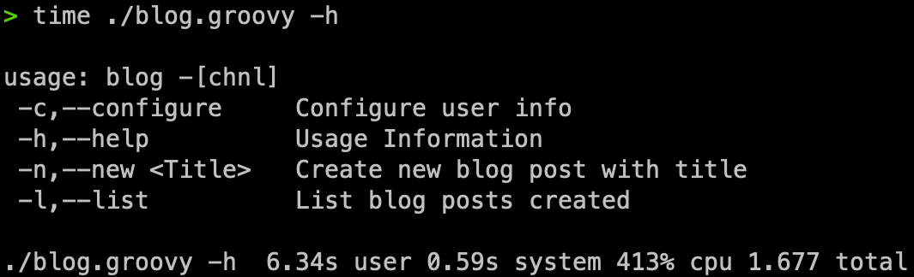
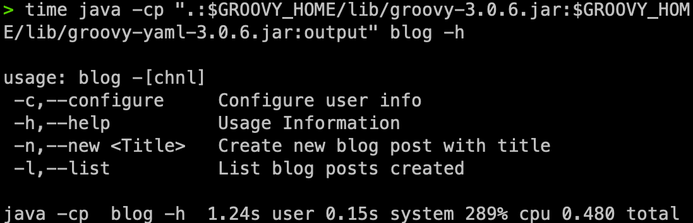
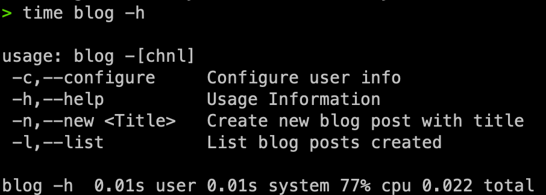

# Create a GraalVM image from blog-jekyll-tool

This guide has been created to help you to create a GraalVM image, feedback is always welcome.

## WARNING

This is still WIP I will remove this warning once is finally fixed.

## Requirements

- sdkman
- Groovy 3.0.6
- GraalVM 21.2.0.r16-grl

## Install GraalVM and Groovy

```shell script
sdk install java 21.2.0.r16-grl
sdk install groovy 3.0.6
```

## Compile Groovy Script

A compiler configuration is included to properly compile with Static Compilation capabilities
```
withConfig(configuration) {
    ast(groovy.transform.CompileStatic)
    ast(groovy.transform.TypeChecked)
}
```

Now in order to use this configuration at compile time we need to run the following command

```shell script
groovyc --configscript compiler.groovy blog.groovy -d output
```

## Run with Java

You can run your script with Java by navigating into the output directory and including in the classpath the Groovy jar file

```shell script
> cd output

> java -cp ".:$GROOVY_HOME/lib/groovy-3.0.6.jar:$GROOVY_HOME/lib/groovy-yaml-3.0.6.jar" blog --help
```

## Build native-image

```shell script
native-image --allow-incomplete-classpath \
--report-unsupported-elements-at-runtime \
--initialize-at-run-time=org.codehaus.groovy.control.XStreamUtils,groovy.grape.GrapeIvy \
--no-fallback \
-cp ".:$GROOVY_HOME/lib/groovy-3.0.6.jar:$GROOVY_HOME/lib/groovy-yaml-3.0.6.jar:$GROOVY_HOME/lib/groovy-dateutil-3.0.6.jar:output" \
-H:ReflectionConfigurationFiles=conf/java-reflections.json,conf/dgm-all-reflections.json,conf/custom-reflections.json \
blog
```

### Sample output

```shell script
[blog:81627]    classlist:   1,089.49 ms,  0.96 GB
[blog:81627]        (cap):   4,676.65 ms,  0.96 GB
[blog:81627]        setup:   6,088.04 ms,  0.96 GB
[blog:81627]     (clinit):     543.61 ms,  6.34 GB
[blog:81627]   (typeflow):  10,004.89 ms,  6.34 GB
[blog:81627]    (objects):  11,367.53 ms,  6.34 GB
[blog:81627]   (features):   1,354.02 ms,  6.34 GB
[blog:81627]     analysis:  24,622.17 ms,  6.34 GB
[blog:81627]     universe:   1,518.12 ms,  6.34 GB
[blog:81627]      (parse):     885.23 ms,  6.34 GB
[blog:81627]     (inline):   1,417.03 ms,  6.00 GB
[blog:81627]    (compile):  11,819.36 ms,  6.25 GB
[blog:81627]      compile:  15,756.98 ms,  6.25 GB
[blog:81627]        image:   3,897.73 ms,  6.25 GB
[blog:81627]        write:   1,089.11 ms,  6.25 GB
[blog:81627]      [total]:  54,274.48 ms,  6.25 GB
# Printing build artifacts to: /Users/omarbautista/Documents/workspace-public/blog-jekyll-tool/blog.build_artifacts.txt

```

### Install the image on your computer

If you are a unix user, you can install this tool to be available anywhere by moving the `blog` output file
to the following location `/usr/local/bin/`

```shell script
mv blog /usr/local/bin/
```

### dgm reflections not recognized
If you have any problem with the dmg reflections not including a class or something you can run the
tool included here

```groovy
groovy dgm-reflections-generator.groovy
```

After finish do not forget to include the file generated to your configuration `-H:ReflectionConfigurationFiles`.


### Custom reflections when the script is modified
If you add a new closure or class and want to include it when compiling to GraalVM first execute this script
that way you will have all the `conf/custom-reflections.json` updated, those are required to compile to native image.

```groovy
groovy custom-reflections-generator.groovy
```

### Benchmark

I've tested this tool running directly with Groovy, then compiling and testing running as Java
including into the classpath the Groovy jars, finally I compiled to native-image and this is the
results:

### Groovy

### Java

### GraalVM
